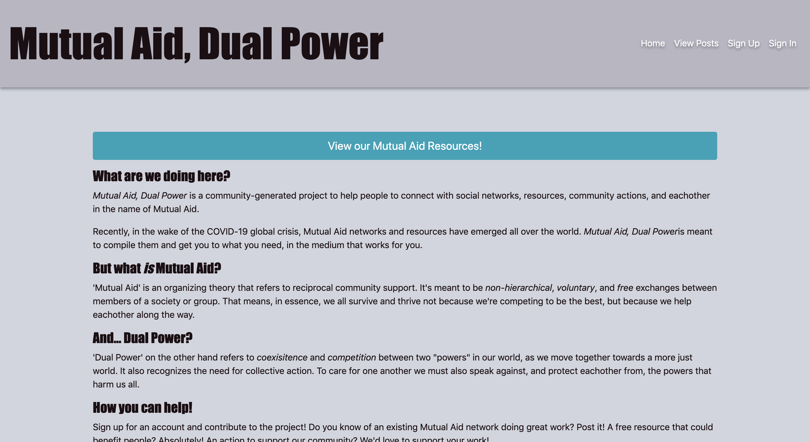

# Mutual Aid, Dual Power: Client Side

## Project Description
This project is a social networking app that is designed to support Mutual Aid network organizing efforts.  Recently, in the wake of the COVID-19 global crisis, Mutual Aid networks and resources have emerged all over the world.  However many of the networks are disconnected and there isn’t a prominent common resource connecting/compiling this information.

This app is intended to stand as a both a network in and of itself, as well as a compilation of other networks and resources to help get users connected to the resources they need, in the medium that works for them.

This repo is the client side application. The project, *Mutual Aid, Dual Power*, works with a 'User' and 'Post' resource, from its custom API, to allow users to register for an authenticated account and then make, edit, and delete their own posts.  Additionally all users, whether registered or not, are able to view all the posts in the database (additionally sorted by the provided 'type').

### Project Links
* [Live Site](https://srsexton94.github.io/mutualaid-client/)
* [Back End Repo](https://github.com/srsexton94/mutualaid-api)
* [Deployed Backend](https://fast-oasis-63373.herokuapp.com/)
* [Project Board](https://github.com/users/srsexton94/projects/1)
* [Resources Spreadsheet](https://docs.google.com/spreadsheets/d/1lGIyPI_Jiy_0qOH_ncmSXQXtWyU1YpWvLBr6guJRPb4/edit#gid=0)

### Mutual Aid & Dual Power
'Mutual Aid' as an organizing theory largely emerged from the writings and activism of [Pyotr Kropotkin](https://en.wikipedia.org/wiki/Peter_Kropotkin), referring to reciprocal community support intended as non-hierarchical, voluntary, and free exchanges between members of a society or group.

'Dual Power' on the other hand, largely attributted to Bolsheviks and [Lenin](https://en.wikipedia.org/wiki/Vladimir_Lenin) but having its origins in the writings of [Pierre-Joseph Proudhon](https://en.wikipedia.org/wiki/Pierre-Joseph_Proudhon), refers to the coexisitence and competition between powers (contextually, proletariat/democratic vs. capitalist/autocratic) in transition away from injustice.

In that vein, this project is intended to offer a means to go *beyond* mutual aid, and help people mobilize and organize towards collective action.

For more information:
- [New York Times - *Feeling Powerless About Coronavirus? Join a Mutual-Aid Network*](https://www.nytimes.com/2020/03/23/opinion/coronavirus-aid-group.html)
- [ROAR - *From Mutual Aid to Dual Power in the State of Emergency*](https://roarmag.org/essays/from-mutual-aid-to-dual-power-in-the-state-of-emergency/?fbclid=IwAR2V59HOXRGC-at-3NqYW2dYp8rh-5DUTbQTTmKwN9c2VGHZiF8qYVpf0XU)
- [the Conversation - *why we feel so driven to help eachother through the coronavirus crisis*](https://theconversation.com/this-anarchist-thinker-helps-explain-why-we-feel-so-driven-to-help-each-other-through-the-coronavirus-crisis-134494?fbclid=IwAR0bnVbD47nr3PL0GjbGz6NwgG5N4tfuHQ8o-OHfkPvwqmDjRV6nTXgZEJI)
- [Wikipedia - *Dual Power*](https://en.wikipedia.org/wiki/Dual_power)
- [Kropotkin - *Mutual Aid: A Factor of Evolution*](https://www.marxists.org/reference/archive/kropotkin-peter/1902/mutual-aid/index.htm) (full text)

## Technologies
On the client side, the technologies used included...
* HTML5
* CSS3
* Sass
* Bootstrap
* JavaScript
* React
  - react-bootstrap
  - react-router-dom
  - styled-components
* axios
* Node.js

## Dependencies (Set up & Installation)
* General Assembly's [React Auth Template](https://git.generalassemb.ly/ga-wdi-boston/react-auth-template) (includes linter, scss, bootstrap, webpack config, npm scripts, auth routes)
* `npm install`: installs dependencies in package.json
* `npm install styled-components`: installs styled components for React styling
* `npm run nag`: runs code quality analysis tools on your code and complains.
* `npm run make-standard`: reformats all your code in the JavaScript Standard Style.
* `npm run start`: generates bundles, watches, and livereloads.
* `npm run build`: place bundled styles and scripts where `index.html` can find them
* `npm run deploy`: builds and deploys master branch

## Planning Process
The planning process for this project began by outlining User Stories abd Wire Frames.  Additionally, though working independently, a [project board](https://github.com/users/srsexton94/projects/1) was made as a task list to track progress.

## User Stories
- As an unregistered user I want to be able to
  - view all public posts and access their content/links
  - sign up/create an account
- As a registered user I want to be able to sign in
- As a signed-in user I want to be able to...
  - sign in, update my info, & sign out
  - view all posts
  - view a specific subdivision of posts
  - view a specific post
  - create, update, and delete my own posts

## Wireframes

 

## Problem Solving
Throughout this project many of the road blocks faced largely ammounted to a few syntax errors and typo bugs.  However, one of the more substantial barriers included variation between controlled and uncontrolled inputs.  In generating the radio buttons dynamically (so that the previously selected value would be pre-checked on an edit view) the radio button inputs oscillated between controlled and uncontrolled.
In order to resolve that issue, the inputs `value` attribute was changed to be a comparison operator - returning the given type *or* an empty string. The empty string will never be reached in this context but allows for the controlled status to remain constant.

More conceptually, the planning of this project placed great emphasis on identifying a suitable MVP scenario, so that the details of the app's basic functionality could be realized more effectively and problems could be more easily parsed.  Additionally, utilizing the project board acted as a visualized trajectory of the project.  This helped greatly in parsing both the intent and execution of each component part of this project.
It also serves the added benefit of increasing accesibility and easing the onboarding process for any new collaborators as this project moves forward.

## Unsolved Problems
At current publication the MVP scenario outlined below is considered successful; as is the first of the Moderate Stretch Goals (displaying posts sorted by type).

The other stretch goals have not yet been attempted and contribution is welcomed. It is vaguely intended to proceed in the order presented below, but the order is more or less flexible.

Additionally, a data collection and cleaning process is underway.  Once the data is adequately formatted, it should be uploaded to the database.

#### MVP
* Provide sign up/in/out and change password
* Display all posts, view a single post, update/delete your own post
* No bugs, alerts, refreshing, or console logs

#### Moderate Stretch Goals
* Display all posts sorted by type (tabs in wireframes)
* Sort posts by time AND location
* Add a search bar?
* Add comments resource to posts
* Update entire account information, not just password
* Add user profile pictures/photos in posts

#### Stretch "for the stars!" Goals
* Offer “forgot password?” change to un-signed in users
* Offer google/facebook authentication
* Display networks and/or offer posts on a map
